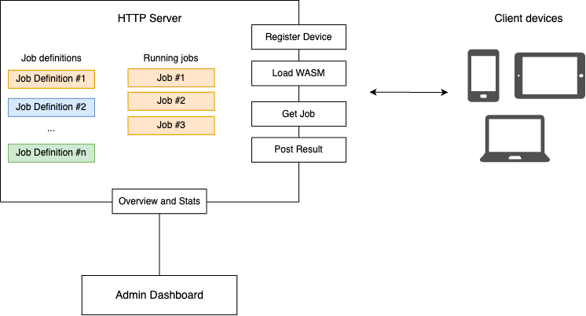
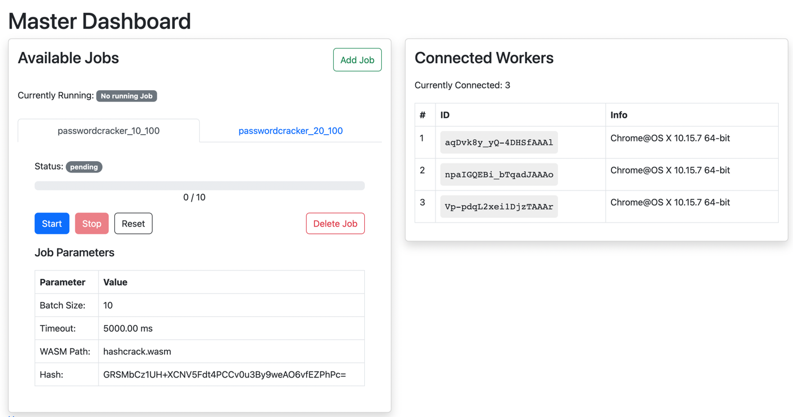
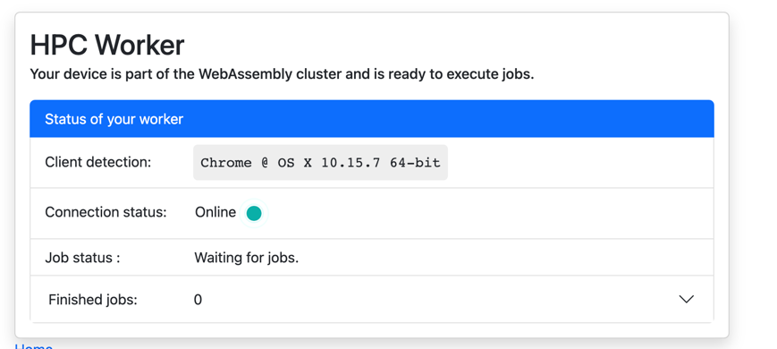

# WebAssembly High Performance Cluster


This repository contains code of a heterogeneous high performance computer cluster, where worker clients can connect through a HTTP Webserver to execute Jobs implemented in WebAssembly.
The connecting devices must be able to run a browser.

## Architecture




## Screenshots





## How to run HPC

```bash
# start production backend
$ cd hpc-server
$ npm run start:prod

# start production frontend
$ cd cluster-frontend
$ npm run build
$ serve -s build -l 80
```
